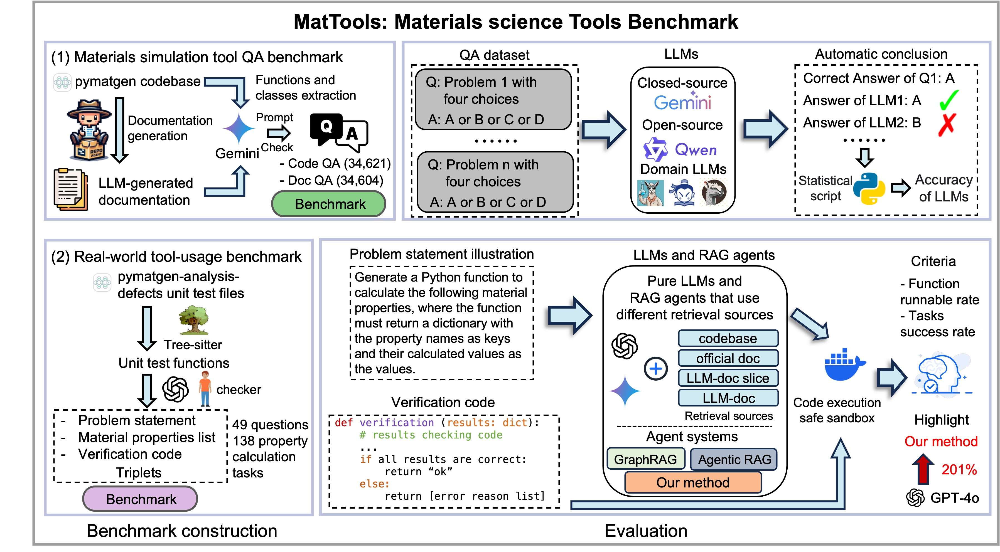
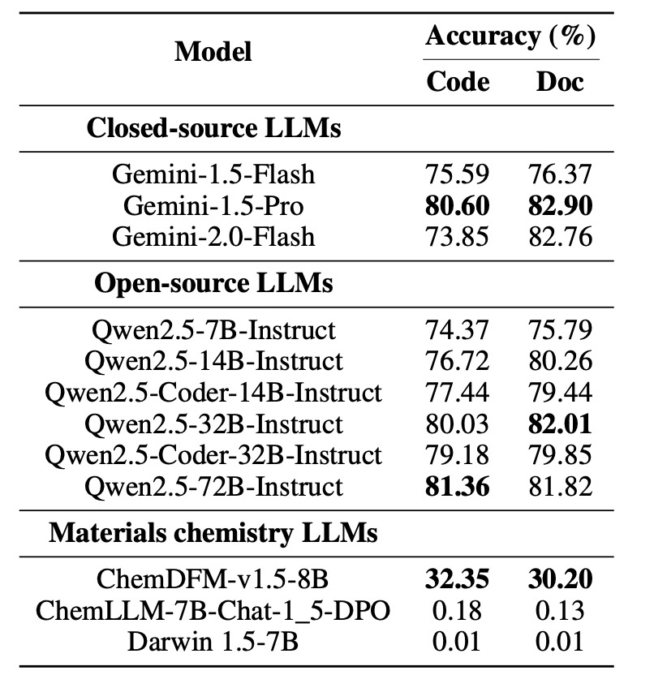
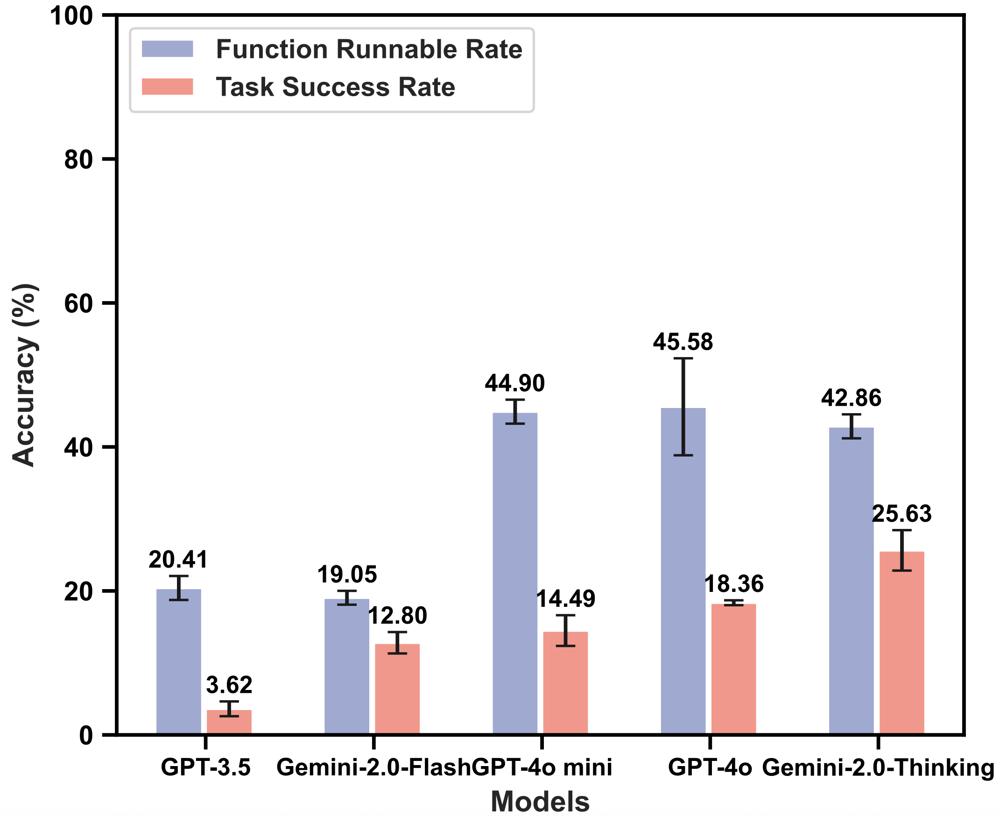
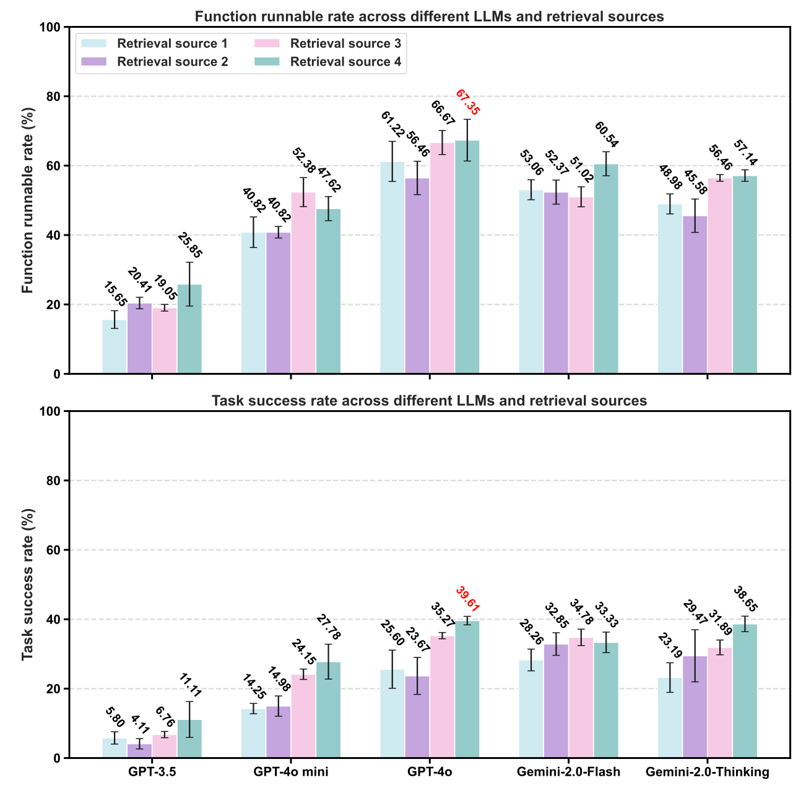
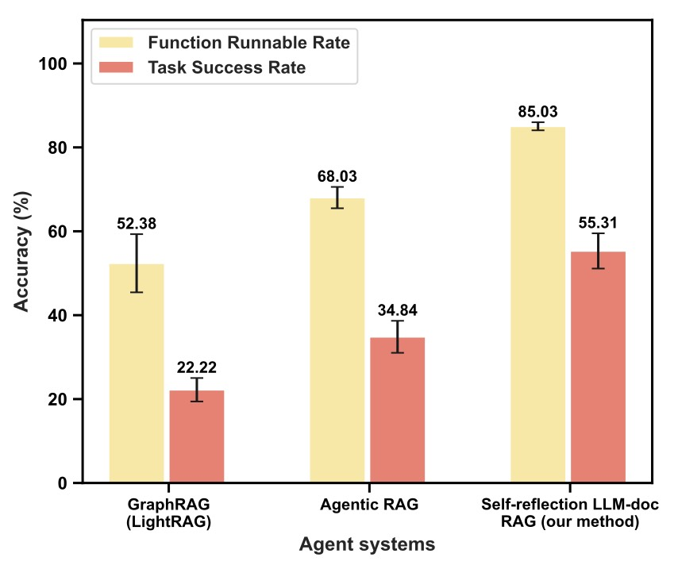

# MatTools
**A Benchmark for Testing Materials Tool Usage Abilities of Large Language Models (LLMs)**  

<p align="center">

</p>

## Datasheet
- pymatgen_code_qa benchmark: `qa_benchmark/generated_qa/generation_results_code.json`, which consists of 34,621 QA pairs.
- pymatgen_code_doc benchmark: `qa_benchmark/generated_qa/generation_results_doc.json`, which consists of 34,604 QA pairs.
- real-world tool-usage benchmark: `src/question_segments`, which consists of 49 questions (138 tasks). One subfolder means a question with problem statement, property list and verification code.

## Leaderboard
- QA benchmark
<p align="center">

</p>

- real-world tool-usage benchmark

Results for single LLMs
<p align="center">

</p>
Results for LLM-RAG with different retrieval sources
<p align="center">

</p>
Results for advanced RAG agent system
<p align="center">

</p>


## How to test
### Environment configuration
We use Conda and Poetry to manage the Python environment.
```bash
conda create -n mattools python=3.13
conda activate mattools
poetry install
```
or you can try install with `requirements.txt`(may face errors).
```bash
conda create -n mattools python=3.13
conda activate mattools
pip install -r requirements.txt
```

### QA benchmark
You can look up the results stored in `qa_benchmark/test_results`.

First, please unzip the two benchmark files (doc and code qa) in `qa_benchmark/generated_qa/`.

```bash
cd qa_benchmark/pymatgen-qa-generation/src
touch .env
GEMINI_API_KEY="Replace your api key here"
```
Then configure your API key with Gemini or download LLM from huggingface.

After that, modify the settings in `settings.py`
```python
TEST_CONFIG = {
    "MODEL_NAME": "gemini-2.0-flash", # model name
    "MODEL_TYPE": "remote", # ['remote', 'local']
    "LOGGER_FILE": "question_evaluation_code_gemini-2-0-flash.log", # log file name
    "CSV_FILE_NAME": "evaluation_results_gemini-2-0-flash.csv", # results file name
    "TEST_FILE_PATH": "generation_results_doc.json", # qa or doc benchmark
}
```
After that, run
```bash
cd qa_benchmark/pymatgen-qa-generation/src
python testing_script.py
```

### real-world tool-usage benchmark
You can just look up the results stored in `pure_agent_test` for single LLMs, `RAG_agent_test` for LLM-RAG, `agentic_RAG_test` for Agentic RAG, `lightrag` for LightRAG, `mtr_rag_test` for `self-reflection LLM-doc RAG system`.

First please configure your API key:
```bash
cd src
touch .env
OPENAI_API_KEY = "Replace your api key here"
GEMINI_API_KEY = "Replace your api key here"
```
0. Generate vector store and configure docker

Unzip `src/documents_llm_doc_gemini_20_flash.json.zip`.

Open `src/construct_doc.ipynb`, run all blocks. 

Or click [Here](https://figshare.com/articles/dataset/Vectore_store_and_lightrag/29080493) to download the vector store and unzip the `vector_store` folder to `src` folder.

**For configuring docker sandbox used for verification generated code** 

Option1: `docker pull grenzlinie/mat-tools:latest`.

Option2: run `docker build -t mat-tool-ben .` at root directory to create docker image. When testing. 

The `result_analysis.py` will automatically generate container for each question.


1. Test single LLM
```bash
cd src
python build_agent.py --model_names gpt-4o-mini-2024-07-18 # generated code
python result_analysis.py --generated_function_path pure_agent_test/gpt-4o-mini-2024-07-18 # execute code and get result analysis
```
2. Test LLM-RAG with different retrieval sources
```bash
cd src
python build_agent.py --model_names gpt-4o-mini-2024-07-18 --retriever_type llm-doc-full
python result_analysis.py --generated_function_path RAG_agent_test/gpt-4o-mini-2024-07-18
```
3. Test agentic RAG
```bash
cd src
python main.py --model_name gpt-4o-mini-2024-07-18 --retriever_type llm-doc-full
python result_analysis.py --generated_function_path agentic_RAG_test/gpt-4o-mini-2024-07-18
```
4. Test LightRAG

Download [LightRAG](https://figshare.com/articles/dataset/Vectore_store_and_lightrag/29080493) to `src` folder.
```bash
cd src/lightrag/LightRAG-main
pip install -e .
export OPENAI_API_KEY="..."
python examples/mattoolben.py
python result_analysis.py --generated_function_path ./lightrag/LightRAG-main/gpt4o_function_generation_results/
```
5. Test self-reflection LLM-RAG agent system
```bash
cd src
python mtr_rag_test/rag.py --model_name gpt-4o-mini-2024-07-18 --retriever_type llm-doc-full
python result_analysis.py --generated_function_path mtr_rag_test/gpt-4o-mini-2024-07-18
```

## How to reproduce
First, the version of pymatgen and pymatgen-analysis-defects must be fixed.
We provided the code of  pymatgen and pymatgen-analysis-defects in `src/tool_source_code/pymatgen/src/pymatgen/`. The code of pymatgen-analysis-defects is in `src/tool_source_code/pymatgen/src/pymatgen/analysis/defects`.

> **pymatgen version 2024.8.9**

> **pymatgen-analysis-defects version 2024.7.19**
### use RepoAgent to generate pymatgen documentation
```bash
pip install repoagent
export OPENAI_API_KEY=YOUR_API_KEY # on Linux/Mac
set OPENAI_API_KEY=YOUR_API_KEY # on Windows
$Env:OPENAI_API_KEY = "YOUR_API_KEY" # on Windows (PowerShell)

cd src/tool_source_code/pymatgen/src/pymatgen
repoagent run (if you use gemini or other model, should set -m model_name --base-url base_url)
```
It will generate markdown for each python file and a summary JSON file. Our summary JSON file generated by gemini-2.0-flash is at `src/project_hierarchy.json`. We used chroma to extract each md_content and code_content in it to `qa_benchmark/pymatgen-qa-generation/src/files/documents_llm_doc_gemini_20_flash_full.json` for generating QA benchmark.

### QA benchmark
First, modify the settings in `settings.py`.
```python
CONFIG = {
    "PROMPT": "code_generation", # ['question_generation', 'code_generation']
    "MODEL_NAME": "gemini-2.0-flash", # model name
    "LOGGER_FILE": "question_generator_code.log", # log file name
    "OUTPUT_FILE": "files/generation_results_code.json", # store path
}
```
Then run:
```bash
cd qa_benchmark/pymatgen-qa-generation/src
python main.py
```

### real-wold tool-usage benchmark
Run all blocks in `src/question_generation/build_qa_test.ipynb`.

(Note: The number of generated triplets may be larger than what we report in our benchmark, as we conducted a manual review process to remove low-quality triplets.)

## 🚀 **About MatToolBen**  
MatTools provides a systematic way to evaluate the ability of LLMs to handle tasks related to materials science tools. It includes question generation, test automation, and an analysis framework, ensuring robust assessment and consistent results.

## Citation
```bibtex
@misc{mattools2025,
  author       = {Siyu Liu, Jiamin Xu, Beilin Ye, Bo Hu, David J. Srolovitz, Tongqi Wen},
  title        = {Mattools: Benchmarking Large Language Models for Materials Science Tools},
  year         = 2025,
  publisher    = {GitHub},
  howpublished = {\url{https://huggingface.co/datasets/SiyuLiu/MatTools/}},
  note         = {Accessed: 2025-05-16}
}
```